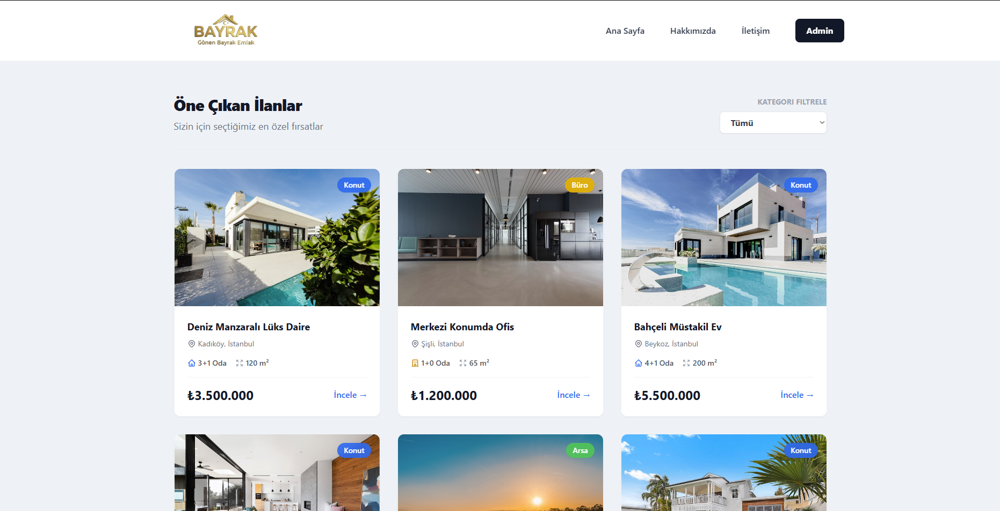

# 🏡 Emlak Yönetim Sistemi

Bu proje, modern bir gayrimenkul / emlak yönetim platformudur. Kullanıcılar satılık/kiralık ev, arsa ve ofis ilanlarını görüntüleyebilir, ilanların detaylarını (oda sayısı, metrekare, kat vb.) inceleyebilir ve konumlara harita üzerinden bakabilir.

## 🚀 Kullanılan Teknolojiler

- **Frontend:** React, TypeScript, Vite, Tailwind CSS, React Router, Axios
- **Backend:** .NET Core Web API (C#)
- **Mimari:** RESTful API ve Modern Component Tabanlı UI

## 🖥️ Uygulama Görselleri

---

### 🎯 Ana Sayfa

---

### 🧑‍💼 İlan Sayfası

---

### 🤖 İlan Detay Sayfası

---

### 🤖 Admin Paneli

---
## 📋 Gereksinimler

Projenin bilgisayarınızda çalışabilmesi için aşağıdakilerin kurulu olması gerekir:
- [Node.js](https://nodejs.org/tr/) (v16 veya üzeri - Frontend için)
- [.NET 8.0 SDK](https://dotnet.microsoft.com/download) (veya kullanımdaki .NET sürümü - Backend için)

## 📂 Proje Yapısı Hakkında
Proje temelde ikiye ayrılmıştır:
- `Backend/`: API uç noktalarının, modellerin ve sunucu tarafı mantığının bulunduğu C# API projesi.
- `Frontend/`: Kullanıcı arayüzünün, sayfaların (Home, About, ListingDetail vb.) ve bileşenlerin bulunduğu Vite/React projesi.
